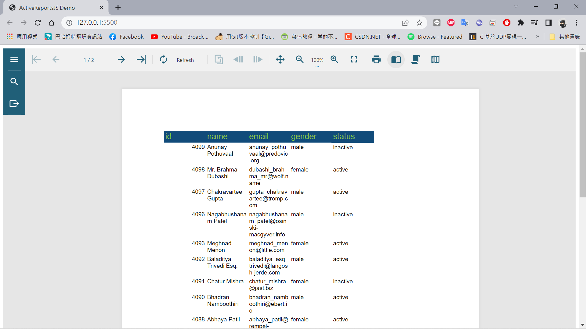

# ActiveRepor_Demo

1. 先安裝ActivReportJS的設計工具 (拉報表用的) 怎麼使用 參考官方文件 https://www.grapecity.com/activereportsjs

2. vscode 安裝 Live Server 套件 方便模擬server

3. npm i @grapecity/activereports 安裝套件

4. 建立畫面

5. 運行

